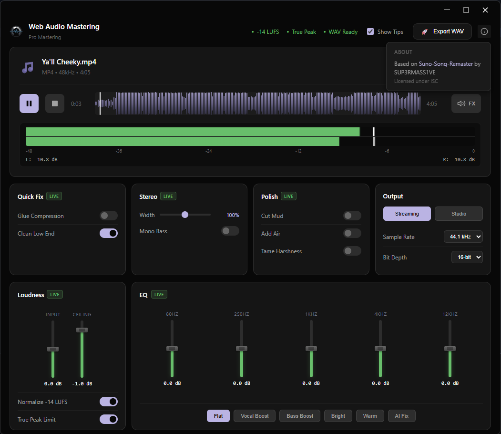

# Web Audio Mastering

A desktop app for mastering AI-generated music (Suno, Udio, etc.) to streaming-ready quality.



## Features

### Loudness & Dynamics
- **Input Gain** - Adjust input level before processing (-12dB to +12dB)
- **Loudness Normalization** - Automatically adjusts to Spotify's -14 LUFS standard
- **True Peak Limiting** - Prevents clipping with adjustable ceiling (-3dB to 0dB)
- **Glue Compression** - Light compression to glue the mix together and add punch

### EQ & Tonal
- **5-Band Parametric EQ** - Fine-tune frequencies (80Hz, 250Hz, 1kHz, 4kHz, 12kHz)
- **EQ Presets** - Flat, Vocal Boost, Bass Boost, Bright, Warm, AI Fix
- **Cut Mud** - Reduce muddy frequencies around 250Hz
- **Add Air** - Sparkle and brightness with 12kHz high shelf boost
- **Tame Harshness** - Reduce harsh frequencies around 4-6kHz

### Low End
- **Clean Low End** - Removes sub-bass rumble below 30Hz

### Stereo
- **Stereo Width** - Adjustable stereo image (0% mono to 200% extra wide) with real-time preview
- **Mono Bass** - Narrows bass below 80Hz for better club/speaker compatibility

### Output
- **Waveform Display** - Visual waveform with click-to-seek functionality
- **Level Meter** - Real-time stereo peak metering with peak hold and overload indicator
- **Real-time Preview** - Hear EQ and effect changes before exporting
- **FX Bypass** - Toggle all effects to compare before/after
- **Streaming Preset** - 44.1kHz/16-bit (Spotify, Apple Music, CD quality)
- **Studio Preset** - 48kHz/24-bit (Studio quality, video production)
- **High-Quality WAV Export** - Lossless output with all processing applied

## Download

Get the latest release for your platform:

- **Windows** - `.exe` portable
- **macOS** - `.dmg` disk image
- **Linux** - `.AppImage`

## Usage

1. Drag & drop an audio file (MP3, WAV, FLAC, AAC, M4A)
2. Preview with the built-in player
3. Adjust EQ and mastering settings
4. Toggle FX bypass to compare before/after
5. Click "Export Mastered WAV"

## Building from Source

```bash
# Install dependencies
npm install

# Run in development
npm start

# Build for your platform
npm run build:win    # Windows
npm run build:mac    # macOS (requires Mac)
npm run build:linux  # Linux
```

## Tech Stack

- Electron 39
- Vite 7 (build system)
- Web Audio API (preview and export processing)
- Pure JavaScript LUFS measurement (ITU-R BS.1770-4)
- WaveSurfer.js (waveform visualization)

## License

ISC

---

## Acknowledgements

This project is based on [Suno-Song-Remaster](https://github.com/SUP3RMASS1VE/Suno-Song-Remaster) by SUP3RMASS1VE, licensed under the ISC License.

```
ISC License

Copyright (c) SUP3RMASS1VE

Permission to use, copy, modify, and/or distribute this software for any
purpose with or without fee is hereby granted, provided that the above
copyright notice and this permission notice appear in all copies.
```
